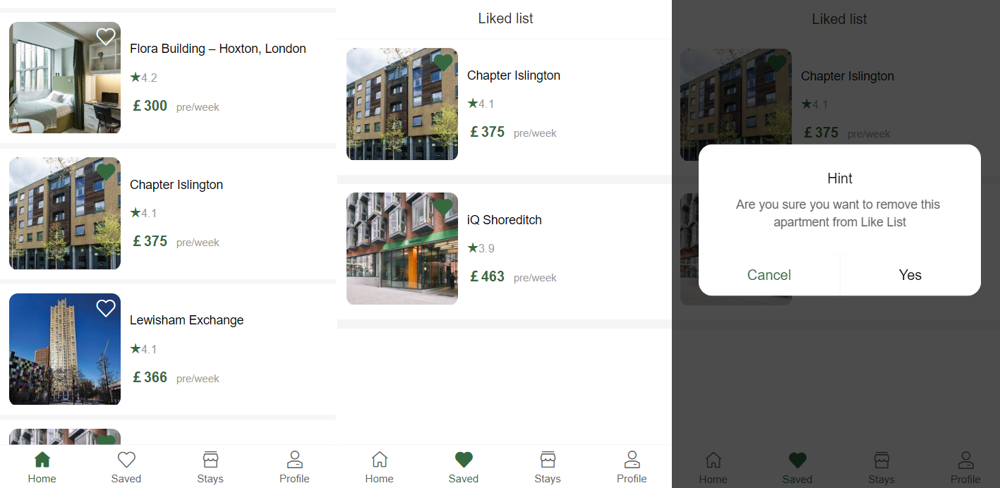

# Rental apartment platform web application

This project aims to develop an Online Rental Apartment platform web application. Based on personal experiences and observations of fellow international students, there is a great need for an online apartment rental platform targeted to the needs of international students. Being a distinct demographic, international students often find themselves in unfamiliar countries and social environments, making the process of finding suitable accommodation a crucial aspect of their journey.

This project will utilize Vue.js for the frontend, Node.js for the backend, and MySQL for the database. The overarching goal is to create a comprehensive platform with key functionalities such as user authentication, property search, apartment selection, and reservation. Moreover, the project is specifically designed for mobile platforms and aims to seamlessly adapt to the majority of smartphones available in the market.

## Login page

## Home page

## Search page

## Apartment detail page

## Room detail page

## Application page

## Profile page

## Like page

## Stays page

The platform facilitates essential operations such as login, searching, selecting accommodations, and reserving them, effectively achieving the core functionalities required for a rental platform.
